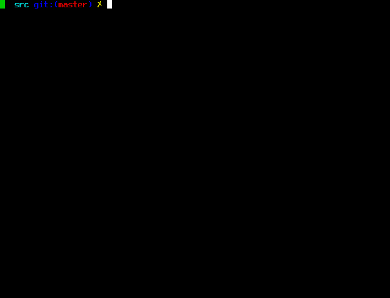

Zside 
===========

What is Zside?
--------------

Zside is a Bitcoin sidechain based off of [Zcash](https://z.cash/).

is an implementation of the "Zerocash" protocol.
Based on Bitcoin's code, Zcash intends to offer a far higher standard of privacy
through a sophisticated zero-knowledge proving scheme that preserves
confidentiality of transaction metadata. More technical details are available
in our [Protocol Specification](https://zips.z.cash/protocol/protocol.pdf).

This software is the Zside client. 

<p align="center">
  
</p>

## Build from Source (Sidechain Version)

### Non-Nix (Ubuntu)

First, install the Zcash build dependencies. These can be found on the 
official [Zcash docs](https://zcash.readthedocs.io/en/master/rtd_pages/Debian-Ubuntu-build.html). 
Only install the dependencies listed in the `apt-get` block, and skip 
the rest of the instructions. 

Once you have installed the build dependencies:

```bash
# build all dependencies
$ make -C ./depends/

$ ./autogen.sh
$ HOST=$(./depends/config.guess)

# Use the previously compiled dependencies instead of system libraries
$ export CONFIG_SITE="$PWD/depends/$HOST/share/config.site"  

# Configure the build
$ ./configure --disable-tests --disable-bench --disable-hardening --enable-online-rust

# Build the Rust C++ bindings + bridge
$ make -C src cargo-build-lib

# Find the location of the newly compiled Rust C++ bridge library
$ BRIDGE_LOCATION=$(dirname $(./contrib/devtools/find-libcxxbridge.sh))

# Instruct the linker to include the Rust C++ bridge library
$ export LDFLAGS="-L$BRIDGE_LOCATION -lcxxbridge1" 

# Reconfigure the build, taking our freshly compiled Rust C++ bridge into account.
$ ./configure --disable-tests --disable-bench --disable-hardening --enable-online-rust

# Run the actual build
$ make -j # omit the -j if running into memory issues
```

The observant reader will note that this requires a bit of back and forth, which
might seem odd. **Two** calls to `./configure`, what's this??

The issue boils down to the following: 

1. We're building a C++ library based on generated C++ code from Rust sources (in the `make -C src cargo-build-lib` step)
2. This needs to have the same C++ toolchain configuration as the rest of the build
3. The output of this (`libcxxbridge1.a`) must be included in the linker flags (`LDFLAGS`) for the build to succeed
3. However, the Rust libraries have to be in place _before_ we invoke `./configure`... This leads to an awkward chicken-or-egg situation.
4. The solution (it might be a strange one, perhaps there's better options) is to run `./configure` _twice_, and doing the Rust build step in-between.

### macOS

Building on macOS is not as well supported as on Linux. The 
upstream Zcash repo doesn't fully support macOS, and our support
is monkey-patched in by a guy who doesn't fully know what he's 
doing.

Building upstream Zcash is not supported _at all_ on ARM chips.
However, macOS has very good support for running x86_64 binaries, 
through Rosetta. We therefore build for x86_64 chips, and use
these binaries to run on both newer and older machine.

Install build dependencies: 

```bash
$ brew install git pkgconfig automake autoconf libtool coreutils
```

The rest of the instructions are the same as for building for 
Linux, except that two environment variables need to be set: 

```bash
export BUILD=x86_64-apple-darwin23.0.0
export HOST=$BUILD
```

These variables have been attempted to be set through the build
system instead, without success. If someone more skilled at the
build system than the previous author strolls along, please 
take a look.

### Cross-compiling from Linux to Windows

Building binaries for Windows must happen through cross-compiling 
from a Linux machine. This requires a rather specific set of 
packages on the host machine, so the easiest way is to do this
through a Docker container. We use the `electriccoinco/zcashd-build-ubuntu-jammy`
image, provided by the upstream Zcash devs.

```bash
# from the root of this repo
$ docker run -ti -v $PWD:/zside --workdir /zside electriccoinco/zcashd-build-ubuntu-jammy bash

$ HOST=x86_64-w64-mingw32 make -C depends V=1 -j8
$ export CONFIG_SITE=$PWD/depends/x86_64-w64-mingw32/share/config.site
$ ./autogen.sh
$ ./configure --disable-tests --disable-bench --disable-hardening --enable-online-rust
$ make -C src cargo-build-lib
$ BRIDGE_LOCATION=$(dirname $(./contrib/devtools/find-libcxxbridge.sh))
$ export LDFLAGS="-L$BRIDGE_LOCATION -lcxxbridge1" 
$ ./configure --disable-tests --disable-bench --disable-hardening --enable-online-rust
$ make -j8

# final result is in ./src/zsided.exe
```

### Nix - currently not working

To install all dependencies and build zcash-sidechain on ubuntu (22.04) run:

```
sudo apt-get update
sudo apt-get upgrade
sudo apt-get install git curl
# install nix package manager
sh <(curl -L https://nixos.org/nix/install) --daemon
# now follow the instructions and then close and open the terminal (to get nix initialized)
git clone git@github.com:nchashch/zcash-sidechain.git
cd zcash-sidechain
nix-shell # this will install all build tools and dependencies
./autogen.sh
./configure $configureFlags
make -j8 # or number of cores you want to use
```

### Regtest Demo Script

A script for: activating this sidechain (on [drivechain](https://github.com/drivechain-project/mainchain/)), mining blocks, depositing and withdrawing coins, generating t/z addresses and using them, is [available here](zside-tour-2022.sh).

License
-------

For license information see the file [COPYING](COPYING).
